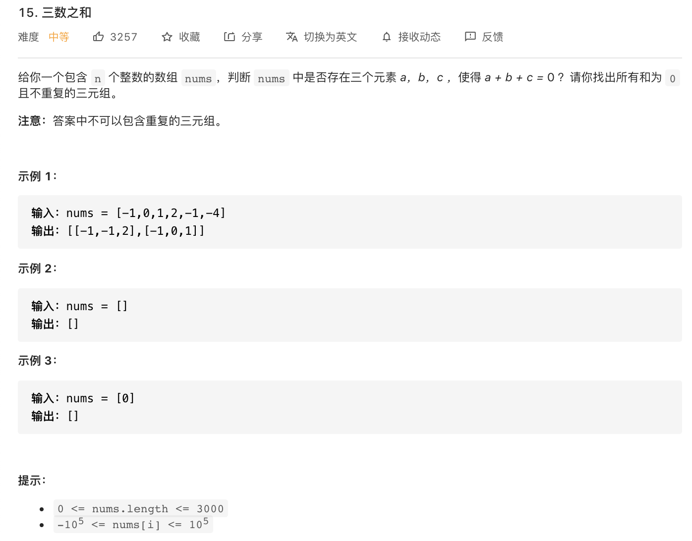

```js
package main

import "sort"

/*
解法一（空间复杂度高，平均时间复杂度高）
从twoSum推算threeSum，遍历到nums[i]时，计算twoSum(nums[i+1:], 0)即可
但是要求不重复，即{-1, -1, -1, 2}，要去重就涉及到排序；因此排序后，排除超过两个的重复数字，再执行上述过程即可。
另外，排序后可以优化解，对当前已遍历到>target的数字后，即可停止遍历

解法二（最优解)
既然都排序了，又知道目标值，肯定是双指针法快一点。注意由于有负数，所以存在加了一个数以后值更小的情况

【start-> index <-end】
outer loop index [start + 1, end - 1]:

	inner loop start < index < end:
		if nums(start + index + end):
			= target: mark, start++, end--
			< target: start++
			> target: end--

去重逻辑:
	start和end碰到相同的直接跳过
	index碰到相同的，直接把start设置为index-1（因为index-1之前的start在前一个相同的index处理时都做过了）
*/

func threeSum(nums []int) [][]int {
	sort.Ints(nums)
	// 最终输出结果，头指针，尾指针，目标值，数组长度，中间计算结果
	result, start, end, target, length, temp := make([][]int, 0), 0, 0, 0, len(nums), 0
	for index := 1; index < length-1; index++ {
		start, end = 0, length-1
		if nums[index] == nums[index-1] {
			start = index - 1
		}

		for start < index && index < end {
			if start > 0 && nums[start-1] == nums[start] {
				start++
				continue
			}

			if end < length-1 && nums[end+1] == nums[end] {
				end--
				continue
			}

			temp = nums[start] + nums[index] + nums[end]
			if temp == target {
				result = append(result, []int{nums[start], nums[index], nums[end]})
				start++
				end--
			} else if temp < target {
				start++
			} else {
				end--
			}
		}
	}
	return result
}
```